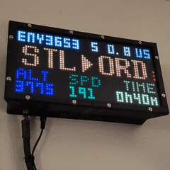

<!-- Title -->
<div align="center">
    <a href="https://github.com/WeegeeNumbuh1/FlightGazer">
    
    </a>
    <h1 align="center">FlightGazer</h1>
    A program to show dump1090 ADS-B info to an RGB-Matrix display.
</div>
<!-- end title section -->

## 🚩 About
This is a personal project that was heavily inspired by [Colin Waddell's project](https://github.com/ColinWaddell/its-a-plane-python), but supplements flight information of
nearby planes with real-time ADS-B and UAT data from [dump1090](https://github.com/flightaware/dump1090) and dump978. Uses the FlightAware API instead of FlightRadar24 to get a plane's departure and destination airports.

Designed primarily to run on a Raspberry Pi and Raspberry Pi OS, but can be run on other setups (your mileage may vary).

As usual, this project was developed before being tracked by `git`. 

## 👀 What it looks like

<div align="center">
<details open>
<summary><b>Show/Hide images</b></summary>

| <div align="center"><br ><i>When a plane enters the area...</i></div> | <div align="center"><br ><i>...and once it leaves.</i></div> |
|---|---|
| <div align="center"><br ><i>Handles multiple planes in the area...</i></div> | <div align="center"><br ><i>...and moments when the API takes its time.</i></div> |
| <div align="center"><br ><i>Handles even odd edge cases like this.</i></div> | <div align="center"><b>Neat 👍</b></div> |

</div>
</details>

## 💪 Features
- Visualize and figure out what planes are flying nearby your location, in a cool-looking way!
  - Shows a plane's callsign (or registration as fallback), distance *and* direction from your location, the plane's country of registration, current altitude, and speed, all provided from `dump1090`
  - With API access you also can see the origin and destination airport, as well as how long the plane has been flying
  - If you don't want to use the API, there's an available "Enhanced Readout" mode that shows even more plane info from `dump1090`, such as latitude, longitude, ground track, vertical speed, and RSSI
- It's a neat looking clock when there aren't any planes flying overhead
  - When `dump1090` is running, shows overall stats like how many planes you're tracking at the moment, how many planes flew by today, and the furthest plane you can detect
- Automatically switches to other plane(s) if more than one is within the area
- Fully Python based
  - The python script has been verified to run in both Linux (Debian) and Windows
- Does not need to run on the same hardware that `dump1090` is running from
- Reads `dump978` data if it's present as well
- Customizable features such as:
  - Range of which planes need to be in for detailed tracking
  - Height filtering
  - Units (aeronautical, metric, or imperial)
  - Clock style (12 hour or 24 hour)
  - Brightness
  - Writing to a stats file that keeps count of number of planes flying by per day (and API usage as well)
  - API limiting per day (those API calls can get expensive)
- Can emulate an RGB Matrix display in a browser if you don't have the actual hardware
- Detailed console output when run interactively
- Small memory footprint
- Runs from a initialization script that handles everything such as initial setup and running the python script (Linux only)
  - Set up to automatically start on boot via `systemd`
- Can be configured to run automatically inside `tmux`
- 🆕 Tested to work with [Ultrafeeder](https://github.com/sdr-enthusiasts/docker-adsb-ultrafeeder) and [ADSB.im](https://adsb.im/home) setups

## 🛠️ Setup
### ⚠️ Prerequisites

<details open><summary><b>Show/Hide</b></summary>

Using this project assumes you have the following:
#### MINIMUM
- A working `dump1090` instance or similar where `/data/aircraft.json` can be read
  - Ex: `tar1090`, `piaware`/`skyaware`, `dump1090-fa`, `dump1090-mutability`, and `readsb`
    - Note: the script will automatically look at these locations and choose which one works
  - This script does not need to be on the same device that `dump1090` is running from (see [Configuration](#️-configuration) section)
- Python 3.8 or newer
- A working internet connection for setup
- *for Linux distros:*
  - `ssh` access if running headless
  - `apt` as the package manager
  - Root access (necessary for accessing the RGBMatrix hardware)
  - `systemd` based system
#### Highly Recommmended
- The [rgbmatrix](https://github.com/hzeller/rpi-rgb-led-matrix) library installed and present on the system
  - Refer to [adafruit's guide](https://learn.adafruit.com/adafruit-rgb-matrix-bonnet-for-raspberry-pi/) on how to get this working if it's not installed already
  - `rgbmatrix` does not need to be strictly installed to run this script (see [Usage](#️-usage) section)
- The physical RGB matrix hardware (again, not strictly necessary)
  - a `32x64` sized matrix display (this is the only layout this script was designed for)
- Your location set in `dump1090`
#### For Enhanced Functionality
- A [FlightAware API key](https://www.flightaware.com/commercial/aeroapi/) (optional) for getting additional plane information such as origin/destination airports
- [RGBMatrixEmulator](https://github.com/ty-porter/RGBMatrixEmulator) (optional, installed by default when using the initalization script) for emulating the display output if you don't have the physical hardware or just want to see the output in a web browser
- a running `dump978` instance if you're in the US and live near airports that handle general aviation more than commercial flights

</details>

### 📶 Installation
Make sure you meet the above prerequisites. To begin:
```
git clone --depth 1 https://github.com/WeegeeNumbuh1/FlightGazer
```
> [!NOTE]
> Once the above command is completed, it is recommended to configure your setup now before running the initalization file. See the [Configuration](#️-configuration) section below, then return to this step.

<details open><summary>if running Linux (Debian) / Raspberry Pi</summary>

then run the following:
```
sudo bash FlightGazer/FlightGazer-init.sh
```
which will set up everything needed to run FlightGazer and then will start FlightGazer afterwards. ([Click here to view what the init.sh file does](#-misc))
</details>
<details><summary>if running Windows</summary>

You will need to put in some elbow grease here.
>[!IMPORTANT]
> You're likely not going to be running `rgbmatrix` on Windows. Instead, use `RGBMatrixEmulator`.

```powershell
pip install psutil
python3 -m venv --system-site-packages "\path\to\new-python-venv"
cd "\path\to\new-python-venv\Scripts"
pip install requests
pip install pydispatcher
pip install schedule
pip install RGBMatrixEmulator
```
If you don't care for running in a virtual environment, skip the `python3 -m venv` and `cd "path\to..."` lines and install the packages globally.

</details>

### 🎚️ Configuration

The [`config.py`](./config.py) file is where settings are configured. It has descriptions/explanations for all configurable options. It is found (and needs to be) in the same directory as the main script itself. Edit it as needed before running FlightGazer.

> [!NOTE]
> If the configuration file is missing or has invalid values, the main script has built-in fallbacks. It will alert you as necessary.

<details><summary>Configuration details for a remote dump1090 installation</summary>

Set `CUSTOM_DUMP1090_LOCATION` to the IP address of the device running dump1090.<br >
Example: `http://192.168.xxx.xxx:8080`

</details>
<br>

>[!TIP]
> To reduce flickering on a physical RGB matrix display, do the following:
> - [Do the PWM mod](https://github.com/hzeller/rpi-rgb-led-matrix?tab=readme-ov-file#improving-flicker)
> - [Reserve a CPU core solely for the display](https://github.com/hzeller/rpi-rgb-led-matrix?tab=readme-ov-file#cpu-use)
> - Lower the value for `LED_PWM_BITS` (though `8` seems good enough)

## 🏃‍♂️ Usage
The main python script ([`FlightGazer.py`](./FlightGazer.py)) is designed to be started by the [`FlightGazer-init.sh`](./FlightGazer-init.sh) file.

> [!IMPORTANT]
> By default, the script is designed to run at boot (via systemd with `flightgazer.service`). You can check its status with:
> ```bash
> sudo systemctl status flightgazer.service
> # or
> sudo tmux attach -d -t FlightGazer
> ```
### ⚙️ Interactive Mode
However, the script and python file are also designed to run interactively in a console. If you run the following command manually:
```
sudo path/to/FlightGazer/FlightGazer-init.sh
```
The script automatically detects that you're running interactively and will display realtime output, like so:
<details><summary>Example output</summary>

```
===== FlightGazer Console Output ===== Time now: 2024-12-01 00:00:00 | Runtime: 98 days, 23:48:05
Filters enabled: <60nmi, <15000ft
(* indicates in focus, - indicates focused previously)
[Inside focus loop 64, watching: 'aa3ae5']

Plane scratchpad: {'aa3ae5', 'a10d75'}
*   [001] UAL343   (US, aa3ae5) | SPD: 263.1kt @ 288.8° | ALT:  8225.0ft,  3520.0ft/min | DIST: NW 22.4nmi (4x.005, -8x.192) | RSSI:  -8.2dBFS
  - [002] N167UD   (US, a10d75) | SPD:  58.7kt @ 283.8° | ALT:  1100.0ft,     0.0ft/min | DIST: E  53.2nmi (4x.985, -8x.078) | RSSI: -23.2dBFS

API results for UAL343: ORD -> SFO, 0:24 flight time

> dump1090 response 28.107 ms | Processing 3.223 ms | Display formatting 0.279 ms | Last API response 349.265 ms
> Detected 154 plane(s), 2 plane(s) in range, max range: 177.2nmi
> API stats for today: 13 success, 0 fail, 0 no data, 0 cache hits
> Total flybys today: 13
> CPU & memory usage: 16.925% overall CPU | 7.734MiB
```
</details>

### 🔡 Optional Behaviors

`FlightGazer-init.sh` supports optional arguments that adjust the behavior of the main python script. Expand the table below to see all possible operating modes. Multiple flags can be passed as well.

<details><summary>Table of operating modes</summary>
<div align="center">

| Flag | Is<br>interactive? | What it does |
|---|:---:|:---:|
| (no flag) | ❌ | Default operating mode when not run as a service. Minimizes console output.<br>Will use `rgbmatrix`. Uses `RGBMatrixEmulator` as a fallback.
|`-d`| ✅ | Do not load any display driver. Only print console output.<br>Overrides `-e`. |
|`-e`| ❌ | Use `RGBMatrixEmulator` as the display driver instead of actual hardware.<br>Display by default can be seen in an internet browser.<br>(see the Tip below)
|`-f`| ✅ | No Filter mode.<br>Ignores set `RANGE` and `HEIGHT_LIMIT` settings and shows all planes detected.<br>Display will never show plane details and remain as a clock.<br>Useful for low traffic areas.|
|`-t`| ✅ | Run in `tmux`. Useful for long-running interactive sessions. <br>Default operating mode when started as a service.
|`-h`| ✅ | Print the help message.

</details>
<br>

> [!TIP]
> An important one is `-e`, which switches the display renderer from `rgbmatrix` to `RGBMatrixEmulator`. This is useful in case you are not able to run the display output on physical hardware and is the fallback when actual hardware is not available.<br> By default, `RGBMatrixEmulator` can be viewed through a web browser: `http://ip-address-of-device-running-FlightGazer:8888`

<details><summary>Advanced use</summary>

There's nothing stopping you from calling the python file directly. However `FlightGazer-init.sh` was designed to make running it smoother by handling the initial setup, making sure all the dependencies are there before running the actual python script, and automatically using the full paths for both the virtual python environment binaries and for the script itself, along with handling any arguments/flags that need to be passed.

You can run it like so:
```
sudo /etc/FlightGazer-pyvenv/bin/python3 /path/to/FlightGazer/FlightGazer.py
```
The main python file accepts the same arguments as the initialization script, but you can always pass `-h` to see all possible operating modes.
</details>

### 👓 Misc

<details><summary>What the initialization script does on first run</summary>

- Checks if there is an internet connection
- Checks if `first_run_complete` exists
  - Checks last modified date: if greater than a month, runs updates for installed dependencies
  - If file exists and is new-ish, then this isn't an initial installation and we just run the main python script
- Updates package list
- Installs:
  - python3-dev
  - python3-venv
  - tmux
- Create a new systemd service `flightgazer.service`
- Write out `RGBMatrixEmulator` config file
- Makes virtual python environment at `etc/FlightGazer-pyvenv`
- Updates `pip` as necessary and installs the following python packages in the virtual environment:
  - requests
  - pydispatcher
  - schedule
  - psutil (usually provided in Raspberry Pi OS)
  - RGBMatrixEmulator
- Writes `first_run_complete` blank file to `etc/FlightGazer-pyvenv` to show initial setup is done

</details>

<details><summary>Running on Windows</summary>

No fancy initialization script here. Run FlightGazer as so:
```
\path\to\new-python-venv\Scripts\python \path\to\FlightGazer\FlightGazer.py -i -e
```
or, if you didn't set up the virtual environment:
```
python \path\to\FlightGazer\FlightGazer.py -i -e
```
Pass `-h` to see all operating modes.

</details>

<details><summary>Useful commands</summary>

Terminating all FlightGazer-related processes (Linux):
```bash
kill -15 $(ps aux | grep '[F]lightGazer.py' | awk '{print $2}')
```
Changing `systemd` startup command
```bash
sudo nano /etc/systemd/system/flightgazer.service
systemctl daemon-reload
```
</details>

## 🚮 Uninstall
```
sudo bash /path/to/FlightGazer/uninstall.sh
```
<details><summary>Windows</summary>

Simply delete the folder (and the virtual python environment if you set that up as well).
</details>

## ❔ Frequently Asked Questions (not really but they could pop up)
<details><summary><b>FAQ's</b></summary>

**Q:** My RGB display is blank when running this, what broke?<br>
**A:** Check the `HAT_PWM_ENABLED` value in `config.py` and make sure it matches your hardware setup.

**Q:** Can I customize the colors?<br >
**A:** Sure, just edit them in the script. (Check the functions inside the `Display` class in the main python file)

**Q:** Can I customize the layout beyond what can be done in `config.py` (clock, plane info, etc)?<br >
**A:** Sure, just like the last question, change some things in the script. 

**Q:** What about showing other plane info like what airline it is or what kind of plane it is?<br >
**A:** That requires additional API calls or another API entirely. Plus, to put all possible text would require scrolling which would complicate things further (I did not feel like I needed this info).<br>
You can also use [Planefence](https://github.com/sdr-enthusiasts/docker-planefence) for this functionality.

**Q:** Why use the FlightAware API? Why not something more "free" like [adsbdb](https://www.adsbdb.com/)?<br >
**A:** adsbdb only has reported route information for aircraft that have predetermined origins and destinations. In my experience, it cannot handle position-only flights (i.e. general aviation, military, etc) and is lacking information for some flights. The commercial APIs handle these situations much more elegantly (which is the price to pay, I guess). Moreover, FlightAware's API is the only commercial one that has a usable free tier. I do wish FlightAware had a much lighter API call for pulling very basic information like what this project uses.

**Q:** Some of your code is not pythonic!!!1!!111 <br>
**A:** but it works, does it not?
</details>

## 🐛 Known Issues and Shortcomings

<details><summary><b>Show/Hide</b></summary>

- Flyby stats are not 100% accurate (but can be close, depending on your `FLYBY_STALENESS` setting in `config.py`)
  - This stat relies on the number of *unique planes seen*, not each occurence of an actual flyby
    - This is somewhat by design, covering the case of living near a general aviation airport and having the same plane do numerous touch-and-go landings
  - ~~For example, if plane with hex ID `abcdef` passes by at 06:00, then passes by again at 18:00, it won't count as a flyby~~ <br>**This has been fixed in v.1.3.0 with the addition of a new parameter, `FLYBY_STALENESS`**
  
- If using `No Filter` mode and restarting FlightGazer often, we can artifically inflate the flyby count
  - FlightGazer has a feature where it will write out stats before shutting down so that it can reload those stats upon restart (if it's the same day). The flyby count is simply a number and has no additional information such as the IDs of planes
  - Upon reload, FlightGazer fills in dummy IDs equal to the value of the last written flyby count in its internal list of plane IDs it keeps track of for flybys
  - The flyby count runs under the assumption that the flyby area itself is small, but since `No Filter` removes that restriction, it's a free-for-all
  - This is not usually a problem, as long as we don't restart often in the same day
  - May not ever get fixed
  
</details>
<br >
Found a bug? Want to suggest a new feature? Open an issue here on Github.

## ✏️ Changelog & Planned Features
Read: [`Changelog.txt`](./Changelog.txt).

Faraway ideas:
- [ ] Docker image?

## 📖 Additional Related/Similar Projects

- [Another `dump1090` x `rgbmatrix` project](https://github.com/Weslex/rpi-led-flight-tracker), but renders out a minimap instead and uses larger RGB matrix panels
  - Fun fact: I used the same font from the above project for FlightGazer
- This [All About Circuits Article](https://www.allaboutcircuits.com/projects/track-overhead-flights-raspberry-pi-zero-w-software-defined-radio/) from 2017
  - Uses all the same core components that this project relies on at a surface-level: FlightAware's API (the older `Firehose` one), `dump1090`, `rgbmatrix`
- [Planefence](https://github.com/sdr-enthusiasts/docker-planefence), a logger for all the planes that flyby your location
  - Inspired the functionality of the stats file FlightGazer writes out
  
## ✅ Acknowledgements
Huge shout out to [RGBMatrixEmulator](https://github.com/ty-porter/RGBMatrixEmulator). This tool was invaluable for getting the layout dialed in and figuring out the logic needed to update the display correctly, all while avoiding having to program directly on the Raspberry Pi itself (VSCode Remote on a Zero 2W is literally impossible, I've tried).

<a href="https://discord.gg/haha98"></a>

^ Thanks to the fellow tech nerds in here for all the suggestions over the evolution of this project