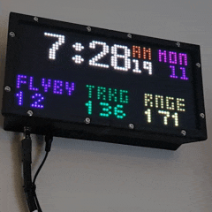
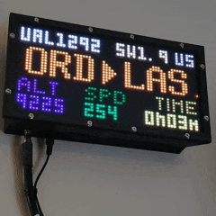
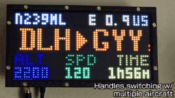
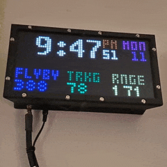
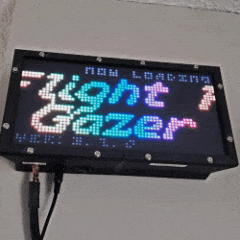
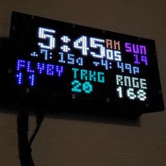

<!-- Title -->
<div align="center">
    <a href="https://github.com/WeegeeNumbuh1/FlightGazer">
    
    </a>
    <h1 align="center">FlightGazer</h1>
    A flight-tracking program that renders ADS-B aircraft info to an RGB-Matrix display.
</div>
<!-- end title section -->

## 🚩 About
This is a personal project that was heavily inspired by [Colin Waddell's project](https://github.com/ColinWaddell/its-a-plane-python), but supplements flight information of
nearby aircraft with real-time ADS-B ([Automatic Dependendent Surveillance - Broadcast](https://aviation.stackexchange.com/questions/205/what-is-ads-b-and-who-needs-it/213#213)) and UAT (Universial Access Transceiver) data from [dump1090](https://github.com/flightaware/dump1090) and dump978. Uses the FlightAware API to get an aircraft's departure and destination airports.

Designed primarily to run on a Raspberry Pi and Raspberry Pi OS, but can be run on other setups (your mileage may vary).

As usual, this project was developed before being tracked by `git`. .<br>Fun fact: this is also the author's second-only Python project.

<details open>
<summary><b>Table of Contents</b></summary>

- [About](#-about)
- [What it looks like](#-what-it-looks-like)
- [Features](#-features)
- [Setup](#️-setup)
  - [Prerequisites (Important)](#️-prerequisites-important)
  - [Installation \& Getting Started](#-installation--getting-started)
  - [Configuration](#️-configuration)
- [Usage](#️-usage)
  - [Interactive Mode](#️-interactive-mode)
  - [Optional Behaviors](#-optional-behaviors)
  - [Shutting Down \& Restarting](#-shutting-down--restarting)
  - [Misc](#-misc)
- [How to Update](#️-how-to-update)
- [Uninstall](#-uninstall)
- [FAQ's](#-frequently-asked-questions-not-really-but-they-could-pop-up)
- [Known Issues](#-known-issues-shortcomings-and-reporting-issues)
- [Changelog \& Contributing](#️-changelog-planned-features-and-contributing)
- [Additional Related/Similar Projects](#-additional-relatedsimilar-projects)
- [Highlights Across Media](#️-highlights-across-media)
- [License \& Warranty](#️-license--warranty)
- [Acknowledgements](#-acknowledgements)

</details>

## 👀 What it looks like

<div align="center">
<details open>
<summary><b>Show/Hide images</b></summary>

| <div align="center"><br><i>When an aircraft enters the area...</i></div> | <div align="center"><br><i>...and once it leaves.</i></div> |
|---|---|
| <div align="center"><br><i>Handles multiple aircraft in the area...</i></div> | <div align="center"><br><i>...and moments when the API takes its time.</i></div> |
| <div align="center"><br><i>Shows a cool splash screen on startup.</i></div> | <div align="center"><b>Neat 👍</b></div> |

|   |
|---|
| <div align="center"> <b>Additional features not shown in the above gifs</b><br></div><br><br><div align="left">- Clock additions:<br>&emsp;- Sunrise & sunset times (shown)<br>&emsp;- dump1090 signal statistics<br>&emsp;- Extended calendar info<br>- Aircraft display:<br>&emsp;- `Enhanced Readout` mode (shown)<br>&emsp;- Blinking callsign upon switch to active aircraft display (shown) or aircraft switch<br>- Brightness changes based on sunrise/sunset or select time-of-day<br>&emsp;- Brightness change when switching to active aircraft (shown)</div> |

</details>

<details><summary>I like this, how do I build my own?</summary>

Coming Soon™.<br>
If you want one, I can also build one for you. (also Coming Soon™)
</details>
</div>

## 💪 Features
***The [Changelog](Changelog.txt) has all the details, but as a bulleted list:***
<details open><summary><b>Show/Hide</b></summary>

### Summary
- Visualize and figure out what aircraft are flying nearby your location, in a cool-looking way!
  - Shows an aircraft's callsign (or registration as fallback), distance and direction from your location, the aircraft's country of registration, current altitude, and speed, all provided from `dump1090`
  - With API access you also can see the origin and destination airport, as well as how long the aircraft has been flying
  - If you don't want to use the API, there's an available "Enhanced Readout" mode that shows even more aircraft info from `dump1090`, such as latitude, longitude, ground track, vertical speed, and RSSI
  - There are a total of 3 different layouts for aircraft info!
- It's a neat looking clock when there aren't any aircraft flying overhead
  - When `dump1090` is running, shows overall stats like how many aircraft you're tracking at the moment, how many aircraft flew by today, and the furthest aircraft you can detect
  - Display sunrise and sunset times, detailed signal stats for your ADS-B receiver, and/or extended calendar info

### Adaptive & flexible
- Automatically switches to other aircraft if more than one is within the area
- Can emulate an RGB Matrix display in a browser if you don't have the actual hardware
- Does not need to run on the same hardware that `dump1090` is running from
- Reads `dump978` data if it's present as well
- Customizable features such as:
  - Range of which aircraft need to be in for detailed tracking
  - Height filtering
  - Units (aeronautical, metric, or imperial)
  - Clock style (12 hour or 24 hour)
  - Brightness based on time of day or when there's an active aircraft shown
  - Writing to a stats file that keeps count of number of aircraft flying by per day (and API usage as well)
  - API limiting per day or by monthly cost (those API calls can get expensive)
  - Colors 🌈
  - Track a specific aircraft once it's detected by your ADS-B receiver
  - Switch between font styles
- Known to work with [PiAware](https://www.flightaware.com/adsb/piaware/build), [ADSBExchange](https://www.adsbexchange.com/sd-card-docs/), [Ultrafeeder](https://github.com/sdr-enthusiasts/docker-adsb-ultrafeeder), and [ADSB.im](https://adsb.im/home) setups
  - Setups that were initially built around using AirNav Radar's `rbfeeder` or Flightradar24's [`Pi24`](https://www.flightradar24.com/build-your-own) need a single settings change (see [Tips](#tricks--tips))

### Other good stuff
- Highly optimized and fast
  - Worst case takes ~20ms on average from raw data to fully parsed, filtered, run through the selection algorithm, and formatted
    - The above statistic taken from a Rasberry Pi Zero 2W w/ 32-bit OS operating as a 99th percentile (worldwide) ADS-B+UAT receiver at peak traffic
- Useful and detailed console output that shows the inner workings of FlightGazer
- Small memory footprint once settled (10-40 MiB)
- Fully Python based
  - The python script has been verified to run in both Linux (Debian) and Windows
- Runs from a initialization script that handles everything such as initial setup and running the python script (Linux only)
  - Set up to automatically start on boot via `systemd`
- Easily update to latest builds here on Github
  - Automagically migrate settings, even if new options appear or are removed in the future
- Can be configured to run automatically inside `tmux`
- 🆕 Program state is available in a json file for use elsewhere
- Robust and hard-to-break 🤞
- Constant development
- Adequate documentation

</details>

## 🛠️ Setup
### ⚠️ Prerequisites (Important)

<details><summary><b>Show/Hide</b></summary>

Using this project assumes you have the following:
#### MINIMUM
- A working `dump1090` instance or similar interface where `/data/aircraft.json` can be read/accessed
  - Ex: [`tar1090`](https://github.com/wiedehopf/tar1090)/[`readsb`](https://github.com/wiedehopf/readsb), [`piaware`](https://www.flightaware.com/adsb/piaware/)/`skyaware`, `dump1090-fa`, `dump1090-mutability`
    - Note: the script will automatically look at these locations and choose which one works
  - This script does not need to be on the same device that `dump1090` is running from (see [Configuration](#️-configuration) section)
- The latest Python
- A working internet connection for setup
- *for Linux distros:*
  - Basic knowledge of how to use `bash` or similar terminal
  - `ssh` access if running headless
  - `apt` as the package manager
  - Root access (necessary for accessing the RGBMatrix hardware)
  - `systemd` based system
#### Highly Recommmended
- The [rgbmatrix](https://github.com/hzeller/rpi-rgb-led-matrix) library installed and present on the system
  - Refer to [adafruit's guide](https://learn.adafruit.com/adafruit-rgb-matrix-bonnet-for-raspberry-pi/) on how to get this working if it's not installed already
  - `rgbmatrix` does not need to be strictly installed to run this script (see [Usage](#️-usage) section)
- The physical RGB matrix hardware (again, not strictly necessary)
  - Using the [adafruit matrix bonnet](https://www.adafruit.com/product/3211)
  - Using `32x64` sized matrix display (this is the only layout this script was designed for)
- Your location set in `dump1090`
- A console that can interpret ANSI escape codes
#### For Enhanced Functionality
- A [FlightAware API key](https://www.flightaware.com/commercial/aeroapi/) (optional) for getting additional aircraft information such as origin/destination airports
- a running `dump978` instance if you're in the US and live near airports that handle general aviation more than commercial flights

</details>
<br>

**tl;dr** You need a running `dump1090` instance and if it's not running on the same device as FlightGazer you need to know a valid URL to access its data.<br>
You don't actually need a physical RGB display, but it's recommended.<br>
*Note:* FlightGazer will not work with UAT-only setups.

### 📶 Installation & Getting Started
Make sure you meet the above prerequisites. To begin:
```
git clone --depth=1 https://github.com/WeegeeNumbuh1/FlightGazer
cd FlightGazer
```
> [!IMPORTANT]
> Once the above command is completed, it is recommended to **configure your setup now** before running the initialization file.<br>See the [Configuration](#️-configuration) section below, then return to this step.

<details open><summary>if running Linux (Debian) / Raspberry Pi</summary>

then run the following:
```
sudo bash FlightGazer-init.sh
```
which will set up everything needed to run FlightGazer and then will start FlightGazer afterwards.<br>
**If you'd like to change the setup behavior before the first run, [check out the options](#-optional-behaviors).**<br>([Click here to view what the init.sh file does](#-misc))
</details>
<details><summary>if running Windows</summary>

You will need to put in some elbow grease here.
>[!IMPORTANT]
> You're likely not going to be running `rgbmatrix` on Windows. Instead, use `RGBMatrixEmulator`.

```powershell
pip install psutil
python3 -m venv --system-site-packages "\path\to\new-python-venv"
cd "\path\to\new-python-venv\Scripts"
pip install requests
pip install pydispatcher
pip install schedule
pip install RGBMatrixEmulator
pip install suntime
pip install orjson
pip install ruamel.yaml
```
If you don't care for running in a virtual environment, skip the `python3 -m venv` and `cd "path\to..."` lines and install the packages globally.<br>
Then, [read here](#-misc).

</details>

### 🎚️ Configuration

Edit [`config.yaml`](./config.yaml) which is found in the same directory as the main script itself.<br>
If you changed any setting, FlightGazer must be [restarted](#-shutting-down--restarting) for the change to take effect.<br>
Example:
```bash
nano config.yaml
# press Ctrl+O to save, Ctrl+X to exit
```

> [!NOTE]
> If the configuration file is missing or has invalid values, the main script has built-in fallbacks. It will alert you as necessary.<br>
> (Just don't try to purposely break the script!)

#### Adjusting Colors
Edit [`colors.py`](./setup/colors.py) in the `setup` folder of FlightGazer.

#### Tricks & Tips
<details><summary>Configuration details for a remote dump1090 installation</summary>

Set `CUSTOM_DUMP1090_LOCATION` to the IP address of the device running dump1090.<br>
Example: `http://192.168.xxx.xxx:8080`

</details>
<details><summary>If you initially built your ADS-B receiver around RadarBox24/AirNav Radar's rbfeeder or Flightradar24's Pi24 image</summary>

`rbfeeder` and `Pi24` setups don't provide a web interface that FlightGazer can look at.<br>
FlightGazer can only run directly on those systems (dump1090 data cannot be read remotely).<br>
Set `PREFER_LOCAL` to `true` so that FlightGazer can read the data from these setups.<br>

If you managed to install a working web interface like `tar1090` with these setups then you're an advanced user and you already know what you're doing.<br>

</details>

<details><summary>Turning off the screen at night</summary>

`ENABLE_TWO_BRIGHTNESS: true`<br>
`BRIGHTNESS_2: 0`

If you don't want it to turn off at sunset,<br>
`USE_SUNRISE_SETSET: false`<br>
then set `BRIGHTNESS_SWITCH_TIME` to whatever time you want.

Note that FlightGazer will still be running *and* driving the screen even with a brightness of `0` so CPU usage will remain the same.

</details>
<details><summary>Only turn on the screen when there's an aircraft nearby (no clock)</summary>

`BRIGHTNESS: 0`<br>
`ENABLE_TWO_BRIGHTNESS: false`<br>
`ACTIVE_PLANE_DISPLAY_BRIGHTNESS: <your value here>`

</details>

<details><summary>Hiding elements on the display</summary>

Go to the color config file and set whatever element you don't want to show to `BLACK`.<br>
Example: `clock_color = BLACK`

</details>

<details><summary>Reduce flickering on a physical RGB matrix display</summary>

- [Do the PWM mod](https://github.com/hzeller/rpi-rgb-led-matrix?tab=readme-ov-file#improving-flicker)
- [Reserve a CPU core solely for the display](https://github.com/hzeller/rpi-rgb-led-matrix?tab=readme-ov-file#cpu-use)
- Lower the value for `LED_PWM_BITS` (though `8` seems good enough)
 
</details>

## 🏃‍♂️ Usage
The main python script ([`FlightGazer.py`](./FlightGazer.py)) is designed to be started by the [`FlightGazer-init.sh`](./FlightGazer-init.sh) file.

> [!IMPORTANT]
> By default, the script is designed to run at boot (via systemd with `flightgazer.service`). You can check its status with:
> ```bash
> systemctl status flightgazer # press 'q' to exit
> # or
> sudo tmux attach -d -t FlightGazer # press 'Ctrl+B' then 'd' to close
> # or
> journalctl -u flightgazer # use arrow keys to navigate, press 'q' to exit
> # or
> tail -n 50 /path/to/FlightGazer/FlightGazer-log.log # read the log output
> ```
### ⚙️ Interactive Mode
However, the script and python file are also designed to run interactively in a console. If you run the following command manually:
```
sudo /path/to/FlightGazer/FlightGazer-init.sh
```
The script automatically detects that you're running interactively and will display realtime output, like so:
<details><summary>Example output</summary>

```
===== FlightGazer v.4.2.0 Console Output ===== Time now: 2025-05-01 00:00:00 | Runtime: 98 days, 23:48:05
Filters enabled: <60nmi, <15000ft, or 'abcdef'
[Inside focus loop 64, next switch on loop 75, watching: 'aa3ae5']

Aircraft scratchpad: {'aa3ae5', 'a10d75'}
[001] UAL343   (US, aa3ae5) | SPD: 263.1kt @ 288.8° | ALT:  8225.0ft,  3520.0ft/min,  4.69° | DIST: NW 22.42nmi LOS 22.67nmi (4x.005, -8x.192) | RSSI:  -8.2dBFS | UNITED AIRLINES, INC. (CHICAGO, IL) - "United"
[002] N167UD   (US, a10d75) | SPD:  58.7kt @ 283.8° | ALT:  1100.0ft,     0.0ft/min,  1.78° | DIST: E  53.28nmi LOS 53.35nmi (4x.985, -8x.078) | RSSI: -23.2dBFS | Private/Military/Unknown

API results for UAL343: [ ORD ] --> [ SFO ], 0h24m flight time

> dump1090+dump978 response 2.617 ms | Processing 3.223 ms | Avg frame render 9.842 ms, 9.3 FPS | Last API response 349.265 ms
> Detected 154 aircraft, 2 aircraft in range, max range: 177.2 nmi | Gain: 40.2dB, Noise: -34.6dB, Strong signals: 3.4%
> API stats for today: 13 success, 0 fail, 0 no data, 0 cache hits | Estimated cost: $4.20
> Total flybys today: 13 | Aircraft selections: 13
> CPU & memory usage: 16.9% overall CPU @ 45.3°C | 7.734 MiB
> Ctrl+C to exit -and- quit FlightGazer. Closing this window will uncleanly terminate FlightGazer.
```
</details>

### 🔡 Optional Behaviors

`FlightGazer-init.sh` supports optional arguments that adjust the behaviors of the FlightGazer installation and main python script. Expand the table below to see all possible operating modes. Multiple flags can be passed as well.

<details><summary>Table of operating modes</summary>
<div align="center">

| Flag | Enables<br>interactive<br>mode in<br>FlightGazer? | What it does |
|---|:---:|:---:|
| (no flag) | ❌ | Default operating mode when not run as a service.<br>Minimizes console output when running non-interactively.<br>Will use `rgbmatrix`. Uses `RGBMatrixEmulator` as a fallback.
|`-d`| ✅ | Do not load any display driver. Only print console output.<br>Overrides `-e`. |
|`-e`| ❌ | Use `RGBMatrixEmulator` as the display driver instead of actual hardware.<br>Display by default can be seen in an internet browser.<br>(see the Tip below)
|`-f`| ✅ | No Filter mode.<br>Ignores set `RANGE` and `HEIGHT_LIMIT` settings and shows all aircraft detected.<br>Display will never show aircraft details and remain as a clock.<br>Useful for low traffic areas.|
|`-t`| ✅ | Run in `tmux`. Useful for long-running interactive sessions. <br>Default operating mode when started as a service.
|`-c`| ❌ | Only install/check dependencies and don't start the main script.
|`-v`| ❌ | Enable verbose/debug messages to be displayed/logged from the main script.
|`-l`| ❌ | Live/Demo mode.<br>Does not install service and runs FlightGazer from dependencies in `/tmp`.
|`-h`| ❌ | Print the help message.

</details>
<br>

> [!TIP]
> An important one is `-e`, which switches the display renderer from `rgbmatrix` to `RGBMatrixEmulator`. This is useful in case you are not able to run the display output on physical hardware and is the fallback when actual hardware is not available.<br> By default, `RGBMatrixEmulator` can be viewed through a web browser:
> - `http://IP-address-of-device-running-FlightGazer:8888`
> - `http://localhost:8888` (on the device running FlightGazer)

<details><summary>Advanced use</summary>

There's nothing stopping you from calling the python file directly. However `FlightGazer-init.sh` was designed to make running it smoother by handling the initial setup, making sure all the dependencies are there before running the actual python script, and automatically using the full paths for both the virtual python environment binaries and for the script itself, along with handling any arguments/flags that need to be passed.

You can run it like so:
```
sudo /etc/FlightGazer-pyvenv/bin/python3 /path/to/FlightGazer/FlightGazer.py
```
The main python file accepts almost all the same arguments as the initialization script, but you can always pass `-h` to see all possible operating modes.
</details>

### 🔕 Shutting Down & Restarting
To shutdown FlightGazer, do any one of the following:
<details><summary>Show/Hide</summary>

```bash
# preferred method
sudo systemctl stop flightgazer
```
```bash
sudo tmux attach -d -t FlightGazer
# then, press 'Ctrl+C' to stop
```
```bash
# if you started FlightGazer interactively and manually
Ctrl+C
```
</details>

To restart, simply do the following:
<details><summary>Show/Hide</summary>

```bash
sudo systemctl restart flightgazer &
# or, if it's currently not running:
sudo systemctl start flightgazer &
```
or, you may [start it manually](#️-interactive-mode).
</details>

### 👓 Misc

<details><summary>What the initialization script does</summary>

- Checks if there is an internet connection
- Checks if `first_run_complete` exists
  - Checks last modified date: if greater than 3 months, runs updates for installed dependencies
  - If file exists and is new-ish, then this isn't an initial installation and we just run the main python script
- Updates package list
- Installs:
  - python3-dev
  - python3-venv
  - tmux
- Create a new systemd service `flightgazer.service` if not present
- Write out `RGBMatrixEmulator` config file
- Makes virtual python environment at `etc/FlightGazer-pyvenv`
- Updates `pip` as necessary and installs the following python packages in the virtual environment:
  - requests
  - pydispatcher
  - schedule
  - psutil (usually provided in Raspberry Pi OS)
  - suntime
  - ruamel.yaml
  - orjson
  - RGBMatrixEmulator
- Writes `first_run_complete` blank file to `etc/FlightGazer-pyvenv` to show initial setup is done
- Runs main python script with desired flags

</details>

<details><summary>Running on Windows</summary>

No fancy initialization script here. Run FlightGazer as so:
```
\path\to\new-python-venv\Scripts\python \path\to\FlightGazer\FlightGazer.py -i -e
```
or, if you didn't set up the virtual environment:
```
python \path\to\FlightGazer\FlightGazer.py -i -e
```
Pass `-h` to see all operating modes.

</details>

<details><summary>Useful commands</summary>

Terminating all FlightGazer-related processes (Linux):
```bash
kill -15 $(ps aux | grep '[F]lightGazer.py' | awk '{print $2}')
```
Changing `systemd` startup command
```bash
sudo nano /etc/systemd/system/flightgazer.service
systemctl daemon-reload
```
Disabling startup at boot
```bash
sudo systemctl disable flightgazer.service
```
</details>

<details><summary>Cool python modules you can use in other projects</summary>

Check the [`utilities`](./utilities/) directory.

</details>

## ⬆️ How to Update
Version v.2.x and newer:
```bash
# recommended
sudo bash /path/to/FlightGazer/update.sh
```
or, to use the most up-to-date version of the update script:
```bash
# alternative approach
cd /path/to/FlightGazer 
wget -O update.sh https://raw.githubusercontent.com/WeegeeNumbuh1/FlightGazer/refs/heads/main/update.sh
sudo bash update.sh
```
<details><summary>Windows</summary>

You can run `git clone --depth=1 https://github.com/WeegeeNumbuh1/FlightGazer \a\different\directory` and manually migrate your config.
</details>

<details><summary>Upgrading from v.1.x to v.2.x and newer</summary>

Use the alternative approach above.<br>
The migrator cannot migrate v.1.x configuration files to the newer format so you must manually migrate your settings.
</details>

## 🚮 Uninstall
```
sudo bash /path/to/FlightGazer/uninstall.sh
```
<details><summary>Windows</summary>

Simply delete the folder (and the virtual python environment if you set that up as well).
</details>

## ❔ Frequently Asked Questions (not really but they could pop up)
<details><summary><b>FAQ's (Open these before raising an issue)</b></summary>

**Q:** My RGB display is blank when running this, what broke?<br>
**A:** Check the `HAT_PWM_ENABLED` value in `config.yaml` and make sure it matches your hardware setup.<br>
Additionally, this project assumes the use of the adafruit rgbmatrix bonnet and only 1 rgb panel. Other setups are not supported.<br>
Getting the RGB display to work is beyond the scope of this project if it wasn't working before using FlightGazer.

**Q:** I broke it 🥺<br>
**A:** Try running the updater first. If it's still broken, uninstall then reinstall FlightGazer.

**Q:** I restarted my system but it took longer for my display to start. What's going on?<br>
**A:** The initialization script that starts FlightGazer checks if there are any updates to the dependencies it uses.
If it has been over three (3) months since it last checked, then the next time it restarts, it will run these checks. It usually only adds a minute or two to the startup time, but if your internet connection is slow or the system is loaded with other processes, then it could take longer.

**Q:** I see a dot on the right of the aircraft readout display. What is it?<br>
**A:** That is an indicator of how many aircraft are within your defined area. The number of dots lit up indicate how many are present. There will always be at least one lit up, all the way to 6. If the number is greater than 1, FlightGazer will start switching between aircraft to show you what else is flying in your area.

**Q:** Can I customize the colors?<br>
**A:** [Click here](#adjusting-colors)

**Q:** Can I customize the layout beyond what can be done in `config.yaml` (clock, aircraft info, etc)?<br>
**A:** Sure, just change some things in the script. Have fun.<br>
(note: any changes done to the main script will be overwritten if you update with the updater) 

**Q:** What about showing other aircraft info like what airline or what kind of aircraft it is?<br>
**A:** That requires additional API calls or another API entirely. Plus, to put all possible text would require scrolling which would complicate things further (I did not feel like I needed this info).<br>
You can also use [Planefence](https://github.com/sdr-enthusiasts/docker-planefence) for this functionality.

**Q:** Why use the FlightAware API? Why not something more "free" like [adsbdb](https://www.adsbdb.com/)?<br>
**A:** adsbdb only has reported route information for aircraft that have predetermined origins and destinations. In my experience, it cannot handle position-only flights (i.e. general aviation, military, etc) and is lacking information for some flights. The commercial APIs handle these situations much more elegantly (which is the price to pay, I guess). Moreover, FlightAware's API is the only commercial one that has a usable free tier. I do wish FlightAware had a much lighter API call for pulling very basic information like what this project uses.

**Q:** Why use a different font for the Callsign? I don't like how it looks different by default next to other readouts.<br>
**A:** The original/default font is perfect with numerical readouts that update frequently (eg: speed, RSSI, altitude, seconds, etc) as the general glyph shape doesn't change between updates.<br>
The alternative font is perfect for the callsign because callsigns are alphanumeric, the readout changes less often, and the alternative font offers quick differentation between between homoglyphs ('0' vs 'O', '5' vs 'S') compared to the default font.<br>
Additionally, with fields that aren't alphanumeric (country code) or use a limited set of the alphabet (direction + distance), there's less of a need for the alternative font's advantages.<br>
If it's too bothersome, set `ALTERNATIVE_FONT` to `true` in the config file to make it more uniform.

**Q:** Some of your code is not pythonic!!!1!!111 <br>
**A:** but it works, does it not? 

</details>

<br>If your question isn't listed in the FAQ's, open an issue here on Github.

## 🐛 Known Issues, Shortcomings, and Reporting Issues

<details><summary><b>Show/Hide</b></summary>

- Flyby stats are not 100% accurate (but can be close, depending on your `FLYBY_STALENESS` setting in your config)
  - This stat relies on the number of *unique aircraft seen*, not each occurrence of an actual flyby
    - This is somewhat by design, covering the case of living near a general aviation airport and having the same plane do numerous touch-and-go landings
  - ~~For example, if plane with hex ID `abcdef` passes by at 06:00, then passes by again at 18:00, it won't count as a flyby~~ <br>**This has been fixed in v.1.3.0 with the addition of a new parameter, `FLYBY_STALENESS`**
  
- If using `No Filter` mode and restarting FlightGazer often, we can artifically inflate the flyby count
  - FlightGazer has a feature where it will write out stats before shutting down so that it can reload those stats upon restart (if it's the same day). The flyby count is simply a number and has no additional information such as the IDs of aircraft
  - Upon reload, FlightGazer fills in dummy IDs equal to the value of the last written flyby count in its internal list of aircraft IDs it keeps track of for flybys
  - The flyby count runs under the assumption that the flyby area itself is small, but since `No Filter` removes that restriction, it's a free-for-all
  - This is not usually a problem, as long as we don't restart often in the same day
  - May not ever get fixed
  
- On rare occasions are times when there will be two entries of the same aircraft (only when using `No Filter` mode)
  - This is an edge case that's been noted since the v.0.x days due to dump1090 listing the same aircraft twice
  - This is further complicated if dump978 is also active and the aircraft uses a dual mode transponder
  - Having MLAT enabled also increases the chances of this bug occurring as you can also get ATC broadcasts of the same aircraft
  - ~~So far there is no fix planned for this as this does not break core functionality~~
    - At worst it confuses the aircraft selector algorithm but even then it still selects normally
    - ~~May be mitigated in the far future~~
  - **This has been mitigated in v.2.6.3 and newer; FlightGazer will pick the first entry it encounters when not using `No Filter` mode**

- If FlightGazer crashes when run in tmux via systemctl, it will always report an exit status of 0
  - Complicated to fix due to all the signal handling between the main script, the initialization script, and systemd
  - May not actually get fixed (simply just code better, smh)
  
</details>
<br>
Found a bug? Want to suggest a new feature? Open an issue here on Github.

If you do encounter an issue, provide a copy of `FlightGazer-log.log` (and `settings_migrate.log` if present) which can be found in the FlightGazer directory.

## ✏️ Changelog, Planned Features, and Contributing
Read: [`Changelog.txt`](./Changelog.txt).

Faraway ideas:
- [x] Brightness changing
- [ ] Docker image?
- [ ] Settings management from webpage?

As FlightGazer is mainly a personal project, it is **currently not open to contributions**. Pull requests will be rejected.<br>
Suggestions, comments, and bug reports are always welcomed and encouraged.<br>
Additionally, word-of-mouth helps plenty!<br>
If you'd like to make your own edits that changes the way the project operates, please fork this project.

## 📖 Additional Related/Similar Projects

- [Another `dump1090` x `rgbmatrix` project](https://github.com/Weslex/rpi-led-flight-tracker), but renders out a minimap instead and uses larger RGB matrix panels
  - Fun fact: I used the same font from the above project for FlightGazer
- This [All About Circuits Article](https://www.allaboutcircuits.com/projects/track-overhead-flights-raspberry-pi-zero-w-software-defined-radio/) from 2017
  - Uses all the same core components that this project relies on at a surface-level: FlightAware's API (the older `Firehose` one), `dump1090`, `rgbmatrix`
- [Planefence](https://github.com/sdr-enthusiasts/docker-planefence), a logger for all the aircraft that flyby your location
  - Inspired the functionality of the stats file FlightGazer writes out

## 🎖️ Highlights Across Media
\* (dust) \* 

## ⚖️ License & Warranty
FlightGazer is licensed under the [GPLv3](https://www.gnu.org/licenses/gpl-3.0.html) license.<br>
In terms of warranty:

```
This program is distributed in the hope that it will be useful,
but WITHOUT ANY WARRANTY; without even the implied warranty of
MERCHANTABILITY or FITNESS FOR A PARTICULAR PURPOSE.
```

## ✅ Acknowledgements
Huge shout out to [RGBMatrixEmulator](https://github.com/ty-porter/RGBMatrixEmulator). This tool was invaluable for getting the layout dialed in and figuring out the logic needed to update the display correctly, all while avoiding having to program directly on the Raspberry Pi itself (VSCode Remote on a Zero 2W is literally impossible, I've tried).

<a href="https://discord.gg/haha98"></a>

^ Thanks to the fellow tech nerds in here for all the suggestions over the evolution of this project