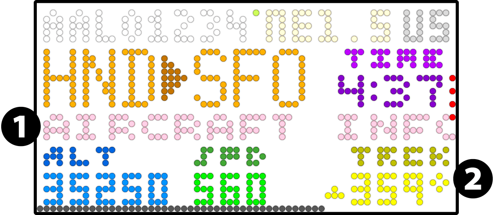
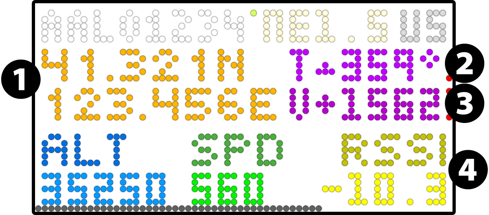

<!-- Title -->
<a id="readme-top"></a>
<div align="center">
    <a href="https://github.com/WeegeeNumbuh1/FlightGazer">
    
    </a>
    <h1 align="center">FlightGazer</h1>
    A comprehensive flight-tracking and logging program that renders ADS-B aircraft info to an RGB-Matrix display.
</div>
<!-- end title section -->

## About
This is a personal/hobbyist project that was heavily inspired by [Colin Waddell's project](https://github.com/ColinWaddell/its-a-plane-python), but supplements flight information of
nearby aircraft with **real-time ADS-B** ([Automatic Dependendent Surveillance - Broadcast](https://aviation.stackexchange.com/questions/205/what-is-ads-b-and-who-needs-it/213#213)) and UAT (Universial Access Transceiver) data from [dump1090](https://github.com/flightaware/dump1090) and dump978.<br>
Uses the [tar1090 database](https://github.com/wiedehopf/tar1090-db) for aircraft type and owner along with an internal database for airline lookup by callsign.<br>
Uses the FlightAware API to get an aircraft's departure and destination airports.

Designed primarily to run on a Raspberry Pi and Raspberry Pi OS, but can be run on other setups (your mileage may vary).

>[!NOTE]
> Fun fact: this is also the [author](https://github.com/WeegeeNumbuh1)'s second-only Python project.<br>

> Every text-based line in this project was typed by hand (beside the fonts and databases), including [documentation](./docs/).<br>
> <b>*No LLM-generated code whatsoever.*</b> (my code lasagna is superior than its slop 😤)

<details open>
<summary><b>Table of Contents</b></summary>

- [About](#about)
- [What it looks like](#what-it-looks-like)
- [Support the Author](#support-the-author)
- [Features](#features)
- [Setup](#️setup)
  - [Prerequisites (Important)](#️-prerequisites-important)
  - [Installation \& Getting Started](#installation--getting-started)
  - [Configuration](#️configuration)
- [Usage](#️usage)
  - [Interactive Mode](#️interactive-mode)
  - [Optional Behaviors](#optional-behaviors)
  - [The Emulator](#the-emulator)
  - [Using FlightGazer's Data](#using-flightgazers-data)
  - [Shutting Down \& Restarting](#shutting-down--restarting)
  - [Output Reference \& Meanings](#️output-reference--meanings)
  - [Misc](#misc)
- [How to Update](#️how-to-update)
- [Uninstall](#uninstall)
- [FAQ's](#frequently-asked-questions-not-really-but-they-could-pop-up)
- [Known Issues](#known-issues-shortcomings-and-reporting-issues)
- [Support \& Discussion](#support--discussion)
- [Changelog \& Contributing](#️changelog-planned-features-and-contributing)
- [Additional Related/Similar Projects](#additional-relatedsimilar-projects)
- [Highlights Across Media](#️highlights-across-media)
- [License \& Warranty](#️-license--warranty)
- [Acknowledgements](#acknowledgements)

</details>

## What it looks like

<div align="center">
<details open>
<summary><b>Show/Hide images (animated gifs)</b></summary>

| <div align="center"><br><i>FlightGazer is a nifty-looking flight tracking system (and clock!).</i></div> |
|---|
| <div align="center"><br><i>Gracefully handles situations when multiple aircraft enter and leave your designated area.</i></div> |
| <div align="center"><br><i>Highly configurable with different layouts and numerous other options to show all the information you could need.</i></div> |
| <div align="center"><br><i>Track a specific aircraft once it's detected by your receiver while still being able to track aircraft in your area.</i></div> |
| <div align="center"><br><i>Shows a cool splash screen on startup.</i></div> |
| <div align="center"><b>Neat 👍</b></div> |

</details>

<details><summary>I like this, how do I build my own?</summary>

[Coming Soon™](./docs/build-your-own-FlightGazer-tracking-box.md).<br>

</details>
<!-- Improved compatibility of back to top link: See: https://github.com/othneildrew/Best-README-Template/pull/73 -->
<p align="right">(<a href="#readme-top">back to top</a>)</p>
</div>

## Support The Author
Like what you see above? I can make you one. *(link coming soon™)*

## Features
***The [Changelog](Changelog.txt) has all the details, but as a bulleted list:***

### Summary
- Visualize and figure out what aircraft are flying nearby your location, in a cool-looking way!
  - Shows an aircraft's callsign (or registration as fallback), distance and direction from your location, the aircraft's country of registration, current altitude, and speed, all provided from `dump1090`
  - With API access you also can see the origin and destination airport, as well as how long the aircraft has been flying
  - If you don't want to use the API, there's an available "Enhanced Readout" mode that shows even more aircraft info from `dump1090`, such as latitude, longitude, ground track, vertical speed, and RSSI
  - With v.6.0.0 and newer, you can see additional info like aircraft type, airline, and owner, all without needing API access
  - There are a total of [3 different layouts for aircraft info](#screen-layout)!
- It's a neat looking clock when there aren't any aircraft flying overhead
  - When `dump1090` is running, shows overall stats like how many aircraft you're tracking at the moment, how many aircraft flew by today, and the farthest aircraft you can detect
  - Display sunrise and sunset times, detailed signal stats for your ADS-B receiver, extended calendar info, and even local weather info
- Extensive logging and [console output](#️-interactive-mode) capabilities as a core function
- Easily configured, controlled, monitored, and updated [within a web browser](https://github.com/WeegeeNumbuh1/FlightGazer-webapp)
- Can emulate an RGB Matrix display in a web browser if you don't have the actual hardware
- Works offline once initial setup is complete (albeit, with no API functionality and as long as `dump1090` is running on the same system)
- Designed to run 24/7

<details><summary><b>More Features</b></summary>

### Adaptive & flexible
- Automatically switches to other aircraft if more than one is within the area
- Does not need to run on the same hardware that `dump1090` is running from
- Reads `dump978` data if it's present as well
- Clock uses your system's locale for weekday/month abbreviations
- Customizable features such as:
  - Range and height ceiling that aircraft need to be in for detailed tracking
  - Units (aeronautical, metric, or imperial)
  - Clock style (12 hour or 24 hour)
  - Brightness based on time of day or when there's an active aircraft shown
  - API limiting per day, by monthly cost, or even by the hour (those API calls can get expensive)
  - Track a specific aircraft once it's detected by your ADS-B receiver
  - Every element on the display can have its color set
  - Switch between font styles
  - and more
- Built to work with [PiAware](https://www.flightaware.com/adsb/piaware/build)/[FlightFeeder](https://www.flightaware.com/adsb/flightfeeder/), [ADSBExchange](https://www.adsbexchange.com/sd-card-docs/), [Ultrafeeder](https://github.com/sdr-enthusiasts/docker-adsb-ultrafeeder), and [ADSB.im](https://adsb.im/home) setups
  - Setups that were initially built around using AirNav Radar's `rbfeeder` or Flightradar24's [`Pi24`](https://www.flightradar24.com/build-your-own) need a single settings change (see [Tips](#tricks--tips))

### Other good stuff
- Highly optimized and fast
  - Worst case takes ~25ms on average from raw data to fully parsed, filtered, run through the selection algorithm, and formatted
    - The above statistic taken from a Rasberry Pi Zero 2W w/ 32-bit OS operating as a 99.9th percentile (worldwide) ADS-B+UAT receiver at peak traffic while sending data to multiple ADS-B aggregators with MLAT
- Small memory footprint once settled (10-40 MiB)
- Fully Python based
  - The python script has been verified to run in both Linux (Debian) and Windows. (MacOS untested)
- All installed components confirmed to run on `ARMv7`, `ARMv8`, `x86_64`, `i686`
- Runs from a initialization script that handles everything such as initial setup and running the python script (Linux only)
  - Set up to automatically start on boot via `systemd`
  - Keeps databases updated over time without having to update to the latest version of FlightGazer
- Easily update to latest builds here on Github
  - Automagically migrate settings, even if new options appear or are removed in the future
- Program state is available in a json file for use elsewhere
- Logs events when you detect aircraft beyond typical ADS-B range limits (DXing)
- Automatically tracks aircraft which report distress signals
- Robust and hard-to-break
- Unique tools and custom-developed fonts that can be used in other projects (don't forget to credit me)
- Constant development
- Adequate documentation

</details>

### Screen Layout
<details><summary><b>Show/Hide</b></summary>
<div align="center">

| Layout | Description |
|---|---|
|  | <b>Clock</b><br>1.	Time, day of week, date<br>2.	Center readout<br>3.	Flyby counter – Number of aircraft that have been in your designated area today<br>4.	Tracking counter – How many aircraft your receiver is currently tracking<br>5.	Range – The distance of the farthest aircraft your receiver can detect<br> |
|  | <b>Journey Readout</b><br>1.	Aircraft's callsign<br>2.	Aircraft's current distance and direction from your site<br>3.	Country of the aircraft<br>4.	Current altitude of the aircraft<br>5.	Current speed of the aircraft<br>6.	Time the aircraft has spent in the air<br>7.	Origin airport<br>8.	Destination airport<br>9.	Current count of aircraft in your specified tracking area<br>10.	UAT indicator<br>11.	Progress bar indicating how long the current aircraft will be displayed<br> |
|  | <b>Journey Plus</b><br>1.	Scrolling marquee (enabled with `Show Even More Info`) or aircraft ground track and vertical speed<br>2.	Ground track of the aircraft (or RSSI of signal when `Show Even More Info` is disabled)<br> |
|  | <b>Enhanced Readout</b><br>1.	Current position of the aircraft<br>2.	Ground track of the aircraft<br>3.	Current vertical speed of the aircraft<br>4.	RSSI – (Received Signal Strength Index) how strong of a signal from the aircraft as detected by the receiver (in dBFS) |

</div>

</details>
<p align="right">(<a href="#readme-top">back to top</a>)</p>

## Setup
### ⚠️ Prerequisites (Important)

<details><summary><b>Show/Hide All</b></summary>

Using this project assumes you have the following:
#### MINIMUM
- A working `dump1090` instance or similar interface where `aircraft.json` can be read/accessed
  - Ex: [`tar1090`](https://github.com/wiedehopf/tar1090)/[`readsb`](https://github.com/wiedehopf/readsb), [`piaware`](https://www.flightaware.com/adsb/piaware/)/`skyaware`, `dump1090-fa`, `dump1090-mutability`
    - Note: the script will automatically look at these locations and choose which one works
  - This script does not need to be on the same device that `dump1090` is running from (see [Configuration](#️-configuration) section)
  - Your ADS-B decoder must output in aeronautical units (nautical miles, knots, feet)
- The latest Python (>=3.10)
- At least 100 MB of available disk space
- A working internet connection for setup
- `git` needs to be installed
- *for Linux distros:*
  - Basic knowledge of how to use `bash` or similar terminal
  - `ssh` access if running headless
  - `apt` as the package manager
  - Root access (necessary for accessing the RGBMatrix hardware)
  - `systemd` based system
#### Highly Recommmended
- The [rgbmatrix](https://github.com/hzeller/rpi-rgb-led-matrix) library installed and present on the system
  - You can use the initialization script to install this, see [this section](#-optional-behaviors) after reading through the setup
  - `rgbmatrix` does not need to be installed to run FlightGazer, however. (see [Usage](#️-usage) section)
- The physical RGB matrix hardware (again, not strictly necessary)
  - Recommended: Using the [adafruit matrix bonnet](https://www.adafruit.com/product/3211)
  - Using `64x32` sized, HUB75 type matrix display (this is the only layout this script was designed for)
  - Other matrix displays and setups can be used as well using advanced settings
- Your location set in `dump1090`
- A console that can interpret ANSI escape sequences (should be most modern ones)
- If using a Raspberry Pi, use a model that has multiple CPU cores (Raspberry Pi 3/Raspberry Pi 2W or newer)
- Not using a combined feed for the data source (you would know if you set this up)
#### For Enhanced Functionality
- A [FlightAware API key](https://www.flightaware.com/commercial/aeroapi/) (optional) for getting additional aircraft information such as origin/destination airports
  - It is highly recommended to generate a key that will only be used for FlightGazer for accurate cost tracking
- A running `dump978` instance if you're in the US and live near airports that handle general aviation more than commercial flights

</details>

**tl;dr** You need a running `dump1090` instance and if it's not running on the same device as FlightGazer you need to know a valid URL to access its data.<br>
You don't actually need a physical RGB display, but it's recommended. You can install this hardware later if you choose to do so.<br>
Other ADS-B decoders will not work. Your site location needs to be set for most of the functionality to work.<br>
*Note:* FlightGazer will not work with UAT-only setups and assumes single-site decoders (not a combined feed).

<details><summary>Not tracking planes yet and want to use this project?</summary>

1. [Follow this guide entirely](https://adsb.im/howto) and use a Raspberry Pi
2. Get SSH access (go to System → Management from the main webpage)
   1. Press the Show Password button in the Generate New Root Password section
   2. Copy the password and press the Accept button
   3. With your SSH client, log into the device at `root@adsb-feeder.local`
3. Continue the below steps and install the web interface as well
4. You can add the RGB Matrix hardware later, expand the prerequisites above for the hardware+software set-up

</details>

### Installation & Getting Started
Make sure you meet the above prerequisites.<br>
There are two approaches:
- Using the web-app (recommended)
- Installing the traditional way (a little more involved)

To begin:
```
git clone --depth=1 https://github.com/WeegeeNumbuh1/FlightGazer
cd FlightGazer
```
Now, choose either one of these methods:
#### Using the web-app
Run this command exactly:
```bash
sudo bash FlightGazer-init.sh -c && echo y | sudo bash install-FlightGazer-webapp.sh
```
Watch the output closely. If the install is successful, near the end of the output will be the URL that you need to navigate to in order to complete the setup.<br>
Once at that webpage, configure settings first and start/restart FlightGazer to apply those settings. Done!

#### Installing the traditional way
If you want finer control over the installation process and didn't use the web-app method above, follow these steps:<br>

- Edit the configuration first (see the section below)
- Run `sudo bash FlightGazer-init.sh`
  - Optional: if you just want to try out FlightGazer without a permanent install, pass the `-l` flag at the end of the above command
  - Additional operating modes are explained [here](#-optional-behaviors)
- To make management easier later on, install the web-app
  - Run `sudo bash install-FlightGazer-webapp.sh`

### Configuration

Edit [`config.yaml`](./config.yaml) which is found in the same directory as the main script itself.<br>
If you changed any setting, FlightGazer must be [restarted](#-shutting-down--restarting) for the change to take effect.<br>
Example:
```bash
cd /path/to/Flightgazer
nano config.yaml
# press Ctrl+O to save, Ctrl+X to exit
```

#### Adjusting Colors
Edit [`colors.py`](./setup/colors.py) in the `setup` folder of FlightGazer.

#### Tricks & Tips
For useful settings with specific setups (e.g. remote dump1090 feeders, custom webinterfaces, etc.), see the [tips-n-tricks](./docs/tips-n-tricks.md) document.

<p align="right">(<a href="#readme-top">back to top</a>)</p>

## Usage
The main python script ([`FlightGazer.py`](./FlightGazer.py)) is designed to be started by the [`FlightGazer-init.sh`](./FlightGazer-init.sh) file.<br>
When FlightGazer is installed, you can use the command `sudo systemctl start flightgazer` to start it if it's not already running.

> [!IMPORTANT]
> By default, the script is designed to run at boot (via systemd with `flightgazer.service`).<br>
> It's much more convenient to check how FlightGazer is running through the web-app.
>
> However, you can also check its status with any of the following commands:
> ```bash
> sudo tmux attach -d -t FlightGazer # press 'Ctrl+B' then 'd' to close
> # or
> systemctl status flightgazer # press 'q' to exit
> # or
> less /path/to/FlightGazer/FlightGazer-log.log # read the log output, press 'q' to quit
> # or
> less /run/FlightGazer/current_state.json
> # or
> journalctl -u flightgazer # use arrow keys to navigate, press 'q' to exit
> ```
### Interactive Mode
The script and python file are designed to run interactively in a console. If you run the following command manually:
```
sudo bash /path/to/FlightGazer/FlightGazer-init.sh
```
The script automatically detects that you're running interactively and will display realtime output, like so:
<details open><summary>Example output</summary>


*Note: In the above gif, FlightGazer is operating in verbose mode. When normally running, there's way less information overload.*

</details>

### Optional Behaviors

`FlightGazer-init.sh` supports optional arguments that adjust the behaviors of the FlightGazer installation and main python script. Expand the table below to see all possible operating modes. Multiple flags can be passed as well.

<details><summary>Table of operating modes</summary>
<div align="center">

| Flag | Enables<br>interactive<br>mode in<br>FlightGazer? | What it does |
|---|:---:|:---:|
| (no flag) | ❌ | Default operating mode when not run as a service.<br>Only prints log entries to `stdout`.<br>Will use `rgbmatrix`. Uses `RGBMatrixEmulator` as a fallback.|
|`-d`| ✅ | Do not load any display driver. Only print console output.<br>Overrides `-e`.|
|`-e`| ❌ | Use `RGBMatrixEmulator` as the display driver instead of actual hardware.<br>Display by default can be seen in an internet browser.<br>(see the next section)|
|`-f`| ✅ | No Filter mode.<br>Ignores set `RANGE` and `HEIGHT_LIMIT` settings and shows all aircraft detected.<br>Display will never show aircraft details and remain as a clock.<br>Useful for low traffic areas.|
|`-t`| ✅ | Run in `tmux`. Useful for long-running interactive sessions. <br>Default operating mode when started as a service.|
|`-c`| ❌ | Only install/force-check dependencies and don't start the main script.|
|`-v`| ❌ | Enable verbose/debug messages to be displayed/logged from the main script.|
|`-l`| ❌ | Live/Demo mode.<br>Does not install service and runs FlightGazer from dependencies in `/tmp`.|
|`-m`| ❌ | Run the `rgbmatrix` install/update script only.<br>Does not start FlightGazer. Overrides all other options.|
|`-h`| ❌ | Print the help message.|

</details>
<details><summary>Advanced use</summary>

There's nothing stopping you from calling the python file directly. However `FlightGazer-init.sh` was designed to make running it smoother by handling the initial setup, making sure all the dependencies are there before running the actual python script, and automatically using the full paths for both the virtual python environment binaries and for the script itself, along with handling any arguments/flags that need to be passed.

You can run it like so:
```
sudo /etc/FlightGazer-pyvenv/bin/python3 /path/to/FlightGazer/FlightGazer.py
```
The main python file accepts almost all the same arguments as the initialization script, but you can always pass `-h` to see all possible operating modes.
</details>

### The Emulator

When FlightGazer does not detect the physical RGB Matrix hardware/software, it falls back to using the display emulator.<br>
To see the display, you can:
- Navigate to the web-app and follow the link to it, or
- Go directly to `http://<IP-address-of-device-running-FlightGazer>:8888`

A viable setup if not using an RGB Matrix display is to:
- Use a second device (laptop, tablet, smart fridge, smart home display, etc.)
- Setting the display to never sleep
- Going to the emulator page in a web browser
- Set the window to full screen

> [!IMPORTANT]
> <b>Running the emulator *is slow!*</b>, especially on single-board computers such as the Raspberry Pi.
> <br><b>Animations might be choppy or laggy</b> depending on your system and enabled settings. (expect about 8-12 FPS on a Raspberry Pi 3/Zero 2W)

#### Raspberry Pi 5 support
Refer to the [Running on a Raspberry Pi 5 document](./docs/using-this-on-a-Raspberry-Pi-5.md).

### Using FlightGazer's Data

When FlightGazer is running, it writes a JSON to `/run/FlightGazer/current_state.json` and updates every `LOOP_INTERVAL` (2 seconds by default).<br>
Additionally, if you're using the web-app, this same JSON is also available at the `/data/current_state.json` endpoint.<br>
You can poll this data for your own use (e.g. a InfluxDB/Telegraf/Grafana stack) and get stats like aircraft details, how long aircraft are in your area, FlightGazer's operating performance, and more.

See the [JSON details](./docs/state-file-schema.md) for a full explanation of this data.

There's also an additional file `flybys.csv` in the same directory that FlightGazer resides in, which tracks hourly cumulative counts of aircraft flybys and API stats. This file is also used by FlightGazer to maintain its daily counts whenever it's restarted.


### Shutting Down & Restarting
It's easier with the web-app.<br>
If that's not in use, to shutdown FlightGazer, do any one of the following:
<details><summary>Show/Hide</summary>

```bash
# preferred method
sudo systemctl stop flightgazer
```
```bash
sudo tmux attach -d -t FlightGazer
# then, press 'Ctrl+C' to stop
```
```bash
# if you started FlightGazer interactively and manually
Ctrl+C
```
</details>

To restart, simply do the following:
<details><summary>Show/Hide</summary>

```bash
sudo systemctl restart flightgazer &
# or, if it's currently not running:
sudo systemctl start flightgazer &
```
or, you may [start it manually](#️-interactive-mode).
</details>

### Output Reference & Meanings

See the [Output Reference](./docs/output-reference.md) document.

### Misc

<details><summary>What the initialization script does</summary>

- Checks if there is an internet connection
- Checks if Python is installed and also checks its version with the minimum requirements
- Checks if `first_run_complete` exists
  - Checks last modified date: if greater than 3 months, runs updates for installed dependencies
  - If file exists and is new-ish, then this isn't an initial installation and we just run the main python script
- Updates package list
- Installs:
  - python3-dev
  - libjpeg-dev
  - python3-numpy
  - python3-venv
  - tmux
- Create a new systemd service `flightgazer.service` if not present
  - Also creates a systemd service for the boot splash screen `flightgazer-bootsplash.service` as well, only if
    the `rgbmatrix` library is present
- Write out `RGBMatrixEmulator` config file
- Makes virtual python environment at `etc/FlightGazer-pyvenv`
- Updates `pip` as necessary and installs the following python packages in the virtual environment:
  - rgbmatrix (if it's not installed globally and is present in the user's folder)
  - requests
  - pydispatcher
  - schedule
  - psutil (usually provided in Raspberry Pi OS)
  - suntime
  - ruamel.yaml
  - orjson
  - beautifulsoup4
  - fake-useragent
  - RGBMatrixEmulator<br>
*if the web app is installed as well:*
  - Flask
  - gunicorn
- Downloads the `tar1090-db` aircraft database and generates a sqlite3 database that can be used by FlightGazer
- Writes `first_run_complete` blank file to `etc/FlightGazer-pyvenv` to show initial setup is done
- Runs main python script with desired flags

</details>

<details><summary>Running on Windows</summary>

You will need to put in some elbow grease here.
>[!IMPORTANT]
> You're likely not going to be running `rgbmatrix` on Windows. Instead, use `RGBMatrixEmulator`.

```powershell
pip install psutil
python3 -m venv --system-site-packages "\path\to\new-python-venv"
cd "\path\to\new-python-venv\Scripts"
pip install requests pydispatcher schedule suntime ruamel.yaml orjson RGBMatrixEmulator
```
If you don't care for running in a virtual environment, skip the `python3 -m venv` and `cd "path\to..."` lines and install the packages globally.<br>
Run FlightGazer as so:
```
\path\to\new-python-venv\Scripts\python \path\to\FlightGazer\FlightGazer.py -i -e
```
or, if you didn't set up the virtual environment:
```
python \path\to\FlightGazer\FlightGazer.py -i -e
```
Pass `-h` to see all operating modes.

</details>

<details><summary>Useful commands</summary>

Terminating FlightGazer-related processes manually (Linux):
```bash
# Just the main FlightGazer process
kill -15 $(ps aux | grep '[F]lightGazer\.py' | awk '{print $2}')
# The web interface (using systemctl is recommended over this)
kill -15 $(ps aux | grep 'FG-webapp.py' | awk '{print $2}')
```
Changing `systemd` startup command
```bash
sudo nano /etc/systemd/system/flightgazer.service
systemctl daemon-reload
```
Disabling startup at boot
```bash
sudo systemctl disable flightgazer.service
```

</details>

<details open><summary>Want to use the same aircraft databases this project uses?</summary>

Check the [`utilities`](./utilities/) directory.

</details>
<p align="right">(<a href="#readme-top">back to top</a>)</p>

## How to Update
Use the web-app .<br>
or:

Version v.2.x and newer:
```bash
# recommended
sudo bash /path/to/FlightGazer/update.sh
```
To use the most up-to-date version of the update script:
```bash
# alternative approach
cd /path/to/FlightGazer
wget -O update.sh https://raw.githubusercontent.com/WeegeeNumbuh1/FlightGazer/refs/heads/main/update.sh
sudo bash update.sh
```

>[!NOTE]
> FlightGazer will *never* implement any self-updating mechanism or any form of push updates.<br>
> An update must be run explicitly by the end user.<br>
> The initialization script, every 3 months after the last update, will check for updates to the aircraft database and other system components required to run, at startup.<br>
> When running the update script, it will pull data [only from this repository](https://github.com/WeegeeNumbuh1/FlightGazer) and nowhere else.

<details><summary>Windows</summary>

You can run `git clone --depth=1 https://github.com/WeegeeNumbuh1/FlightGazer \a\different\directory` and manually migrate your config.
</details>

<details><summary>Upgrading from v.1.x to v.2.x and newer</summary>

Use the alternative approach above.<br>
The migrator cannot migrate v.1.x configuration files to the newer format so you must manually migrate your settings.
</details>
<p align="right">(<a href="#readme-top">back to top</a>)</p>

## Uninstall
```
sudo bash /path/to/FlightGazer/uninstall.sh
```
<details><summary>Windows</summary>

Simply delete the folder (and the virtual python environment if you set that up as well).
</details>

## Frequently Asked Questions (not really but they could pop up)

👉 [**Read This First**](./docs/FAQs.md)

If your question isn't listed in the FAQ's, open an issue here on GitHub.

## Known Issues, Shortcomings, and Reporting Issues
>[!WARNING]
> FlightGazer must constantly run as root.
- This is unavoidable due to the need to interact with low-level hardware to drive the RGB display.
  - The rgbmatrix library is capable of dropping root privleges, however doing so will cause [essential write operations to fail](https://github.com/hzeller/rpi-rgb-led-matrix/tree/master/bindings/python#user).
    - Additionally, not running as root will reduce performance, which we need the most of since this is all based on Python.
  - The FlightGazer service is designed to be a *system service* and starts the main script with higher CPU and disk priority.
  - Related processes like the web-app must also run as root since it needs to be able to start or stop the FlightGazer service.
  - Even though the emulator does not need to run as root, it will still inherit root permissions due to the way FlightGazer runs.
    - Same goes for running in `NO_DISPLAY` mode (`-d`).
- If you're not comfortable with this, do not use this project.
  - *or*, suggest code changes which may reduce the attack surface.

See also: [Other Quirks & Features™](./docs/known-issues-and-shortcomings.md)

Found a bug? Want to suggest a new feature? Open an issue here on GitHub.

If you do encounter an issue, provide a copy of `FlightGazer-log.log` which can be found in the FlightGazer directory.<br>
If using the web-app, you can download all the logs as a zip file from the "Details and Logs" page.
<p align="right">(<a href="#readme-top">back to top</a>)</p>

## Support & Discussion
Refer to the [Support Links](/docs/support-links.md) document.

## Changelog, Planned Features, and Contributing
Catch up on lore: [`Changelog.txt`](./Changelog.txt).

Faraway ideas:
- [ ] ~~Docker image?~~ (unlikely)
- [ ] Support display output to a [FlightFeeder Pro](https://flightaware.store/products/flightfeeder-pro-ads-b-flight-tracker-1090-mhz-piaware)?

>[!IMPORTANT]
> As FlightGazer is developed primarily as a personal project, it is **currently not open to contributions**.<br>Pull requests will be rejected.

Suggestions, comments, and bug reports are always welcomed and encouraged.<br>
Additionally, word-of-mouth helps plenty! If you're already this far into the readme, spread the word!<br>
If you'd like to make your own edits that changes the way the project operates, please fork this project.<br>
If there's something not addressed here, please reach out to me directly.
<p align="right">(<a href="#readme-top">back to top</a>)</p>

## Additional Related/Similar Projects

- [Another `dump1090` x `rgbmatrix` project](https://github.com/Weslex/rpi-led-flight-tracker), but renders out a minimap instead and uses larger RGB matrix panels
  - Fun fact: I used the same font from the above project for FlightGazer
- This [All About Circuits Article](https://www.allaboutcircuits.com/projects/track-overhead-flights-raspberry-pi-zero-w-software-defined-radio/) from 2017
  - Uses all the same core components that this project relies on at a surface-level: FlightAware's API (the older `Firehose` one), `dump1090`, `rgbmatrix`
- [Planefence](https://github.com/sdr-enthusiasts/docker-planefence), a logger for all the aircraft that flyby your location
  - Inspired the base functionality of FlightGazer
- [Skystats](https://github.com/tomcarman/skystats), a fancier way to show aircraft stats
   - FlightGazer does aircraft stats via the log, but the above is a prettier way to see similar data (FlightGazer still tracks different aspects not covered by Skystats)
- [MLB-LED-Scoreboard](https://github.com/MLB-LED-Scoreboard/mlb-led-scoreboard), instead of planes, track baseballs (another project that uses these RGB matrix panels)
- Other "FlightGazer"-like projects:
  - [This one off of Reddit](https://old.reddit.com/r/ADSB/comments/1py0a9z/my_custom_adsb_approach_display_video/)
  - [A modified 'its-a-plane' version](https://www.etsy.com/listing/4346934119/aviation-whats-flying-overhead-display) (Etsy)
<p align="right">(<a href="#readme-top">back to top</a>)</p>

## Highlights Across Media
\* (dust) \*

## ⚖️ License & Warranty
FlightGazer is licensed under the [GPLv3](https://www.gnu.org/licenses/gpl-3.0.html) license.<br>
In terms of warranty:

```
This program is distributed in the hope that it will be useful,
but WITHOUT ANY WARRANTY; without even the implied warranty of
MERCHANTABILITY or FITNESS FOR A PARTICULAR PURPOSE.
```
If you intend to use this project, the code must remain open source.

## Acknowledgements
Huge shout out to [RGBMatrixEmulator](https://github.com/ty-porter/RGBMatrixEmulator). This tool was invaluable for getting the layout dialed in and figuring out the logic needed to update the display correctly, all while avoiding having to program directly on the Raspberry Pi itself (VSCode Remote on a Zero 2W is literally impossible, I've tried).

<a href="https://discord.gg/haha98"></a>

^ Thanks to the fellow tech nerds in here for all the suggestions over the evolution of this project
<p align="right">(<a href="#readme-top">back to top</a>)</p>